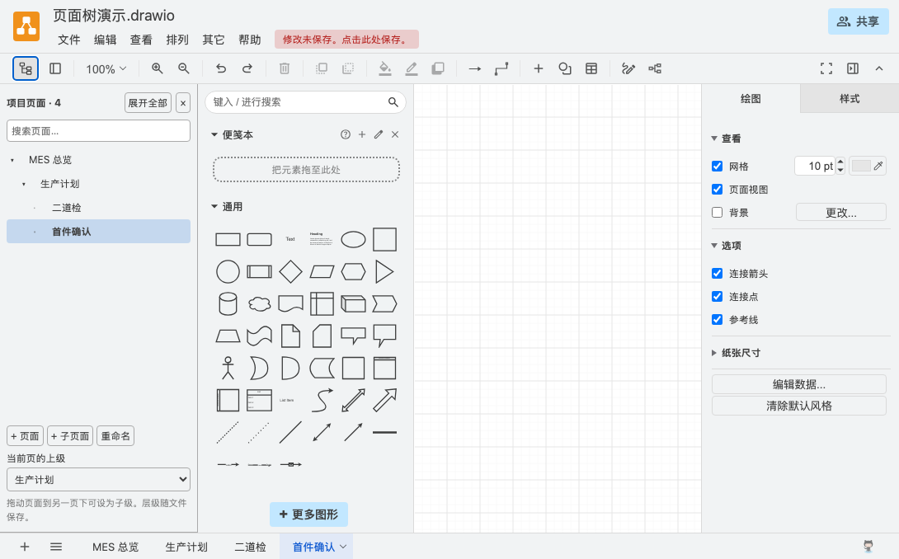

# Page Tree Desktop · 页面树增强版

**页面太多找不到？把 Draw.io 的 sheet 整理成能搜索、能折叠的多级项目树。**

面向多页面流程图、业务模块设计和项目文档。工具栏最左侧一键展开独立页面面板，按父子关系组织页面，点击即可跳转。

这是基于 Draw.io 31.4.5 的个人维护分支，**非官方发布，与 draw.io 官方无隶属关系或背书关系**。桌面应用使用独立名称与图标：Page Tree Desktop。

[下载安装包](https://github.com/kangshifu1/drawio/releases/tag/v31.4.5-page-tree.1) · [使用说明](PAGE-TREE.md) · [安装说明](docs/INSTALL.md) · [更新日志](CHANGELOG-PAGE-TREE.md) · [源码构建](packaging/README.md)



## 这个版本增加了什么

- **独立页面面板**：工具栏首位图标控制展开／收起，面板位于元素选择区左侧。
- **多级页面层级**：页面可以挂到另一个页面下，用于组织项目和业务模块。
- **搜索与定位**：按名称查找页面，保留父级上下文，点击切换 sheet。
- **拖拽整理**：拖动或通过上级下拉框调整父子关系。
- **页面管理**：新增页面、新增子页面、重命名，支持相应的原生撤销／重做。
- **随文件保存**：层级写入 `.drawio` 文件，重命名不影响关系。

## 下载与开始使用

前往 [首个预发布版本](https://github.com/kangshifu1/drawio/releases/tag/v31.4.5-page-tree.1)，选择 Mac Apple 芯片、Mac Intel 或 Windows x64 安装包。打开图纸，点击工具栏最左侧树形图标，即可设置页面层级。

安装包为个人构建：Mac 未做 Apple 开发者签名与公证，Windows 未做发布者签名，安装时系统可能提示。Windows 尚未经过实机安装验证。本版适合试用和反馈，详见 [安装说明与验证范围](docs/INSTALL.md)。

也可以直接本地运行网页版：

```sh
python3 -m http.server 8765 --bind 127.0.0.1 --directory src/main/webapp
```

访问 `http://127.0.0.1:8765/?ui=kennedy&lang=zh&mode=device&splash=0`。

## 当前范围

管理单个文件中的多页图纸，暂不包含跨文件工作区、独立目录节点或层级协作同步。原有图纸首次打开为平铺页面，需要手动设置父子关系。自定义层级属性经其他编辑器再次保存时是否保留，取决于对方实现。桌面版关闭自动更新，升级需要手动安装新版本。

---

## 上游项目与许可证

以下保留上游项目说明及授权条款。上游托管服务、支持和贡献政策不代表本分支提供同等服务。

# draw.io

## About

draw.io is a configurable diagramming and whiteboarding application, jointly owned and developed by draw.io Ltd (previously named JGraph) and draw.io AG. We also run a production deployment at https://app.diagrams.net.

## License

The source code in this repository is licensed under the [Apache License 2.0](LICENSE).

The icon sets, stencil libraries, and diagram templates are provided under the following terms:

> The icon sets and stencil libraries included in this software, and any derivatives thereof (including conversions to other formats, traced reproductions, substantially similar visual representations, or AI-generated images created using these icons as reference or training input), may not be used as software assets in, distributed for use with, or incorporated into Atlassian products or products distributed through the Atlassian marketplace or plugin ecosystem, without explicit written permission.
>
> This restriction does not apply to end-user diagram output (such as exported images or documents) created using this software.

Some icons are originally defined by third-party copyright holders; we have verified that all original licenses permit use in this project. Additional third-party JavaScript libraries are included, all with licenses compatible with Apache 2.0 (no GPL or AGPL).

We make no copyright claim on diagrams you create with this software.

## Upstream contributions

The upstream project does not accept pull requests; its development is handled by the upstream core team. For this personal fork, report page-tree feedback in this repository.

## Scope

draw.io is a diagramming and whiteboarding application. It is not an SVG editor. SVG export is intended for embedding in web pages, not for editing in other tools.

Note that draw.io does not support real-time collaborative editing in this version, currently.

For issues or questions about the editor in any draw.io product, the issue tracker and discussions here are a good starting point.

## Running

Options for running draw.io:

- Fork this repository and [publish to GitHub Pages](https://help.github.com/categories/github-pages-basics/) for a [fully functional editor](https://jgraph.github.io/drawio/src/main/webapp/index.html) (without integrations)
- Use the [official Docker image](https://github.com/jgraph/docker-drawio)
- Download [draw.io Desktop](https://get.diagrams.net)

Packaged .war files are available on the [releases page](https://github.com/jgraph/draw.io/releases).

## Supported Browsers

Chrome 123+, Firefox 120+, Safari 17.5+, Opera 109+, Edge 123+, WebView Android 137+, Safari iOS 18.5+.

## Trademark

draw.io is a registered EU trademark (#018062448).

Do not use the draw.io name or logo in ways that suggest affiliation with, endorsement by, or sponsorship by draw.io. Do not use draw.io logos for your own business, product, project, domain, or social media presence. Do not modify the draw.io logos. Use of draw.io trademarks requires prior written permission.